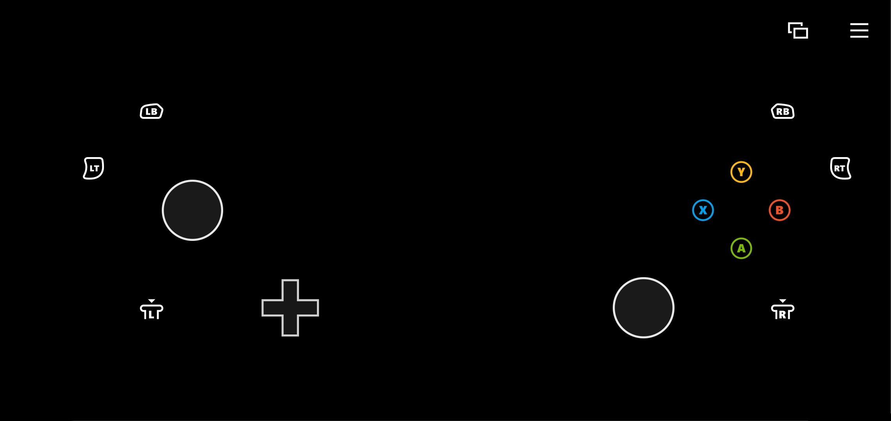
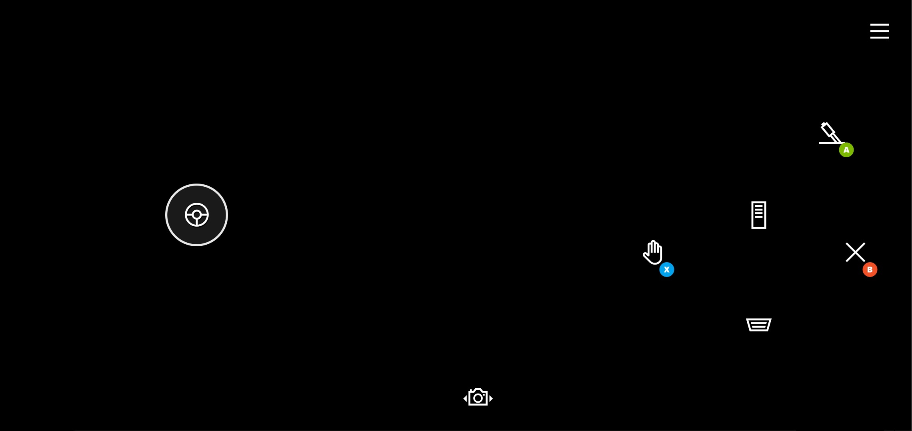
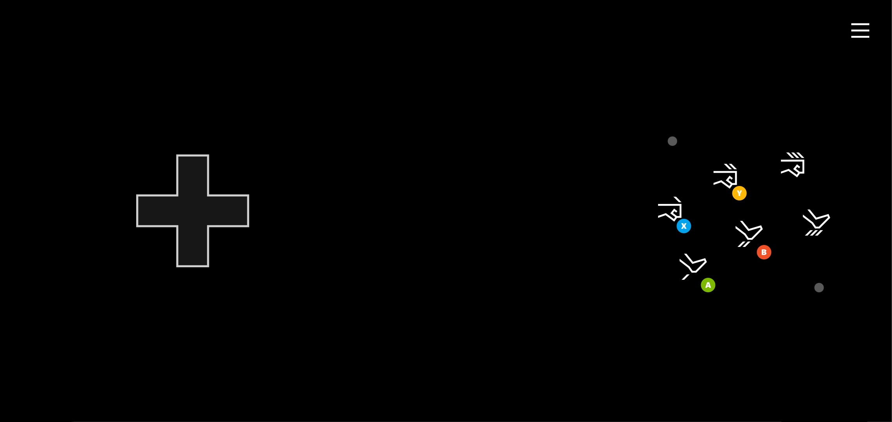
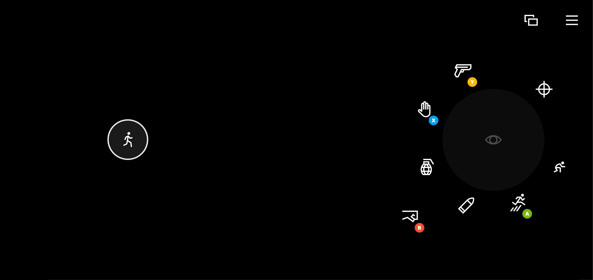
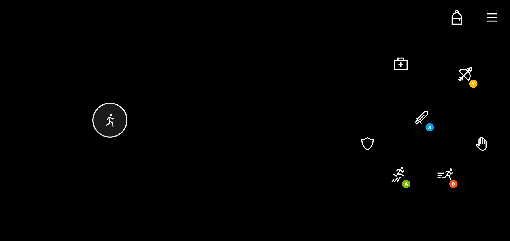

# Touch Adaptation Bundles

## Sample Layouts
Includes a set of layouts that represent common patterns in different games.

| **Layout** | **Description** | **Preview** | 
| :--- |  :--- |  :--- |
| standard controller | Layout that provides a mapping of all physical controller actions. Default layout for the sample-layout.takx bundle.|  |
| driving | Layout for driving games that uses the left hand for steering, the right for gas/brake and interactions. |  |
| fighting | Layout for fighting games using a familiar arcade like layout.|  |
| first person shooter | Layout for first person shooter games, using a touchpad for looking around and a variety of weapon and movement buttons. |  |
| platformer simple | Basic layout for platformer games with only three actions (jump, fire, interact). |  |
| platformer | Layout for platformer games that have more actions for the player to use. |  |
